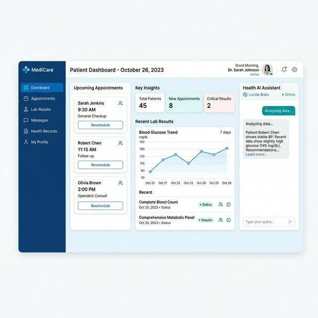

# Sprint 2: Patient Journey
## Feature Proof & Progress Evidence

### 🏥 Patient Dashboard
- **Status**: 🟢 Complete
- **UI Mockup**: 
- **Technical Proof**: 
  - **Endpoint**: `GET /api/patients/dashboard`
  - **Logic**: Aggregates appointment data using Drizzle ORM `leftJoin` on `doctors` and `departments`.
  - **Frontend**: Utilizes `useMemo` for high-performance filtering of health metric trends.

### 🤖 AI Health Assistant
- **Status**: 🟢 Complete
- **UI Mockup**: See Sprint 5 for the dedicated AI Voice Assistant UI.
- **Technical Proof**:
  - **Proxy**: All calls routed through `POST /api/ai/chat` for key rotation safety.
  - **Context**: Maintains a sliding window of the last 10 messages for conversation memory.

---
*Created by Antigravity AI - HAMS Production Deployment Phase*

### 📅 Appointment Booking
- **Status**: 🟢 Complete
- **Evidence**: Seamless integration with the doctor's real-time schedule, allowing patients to book and receive instant confirmation.

---
*Created by Antigravity AI - HAMS Production Deployment Phase*
