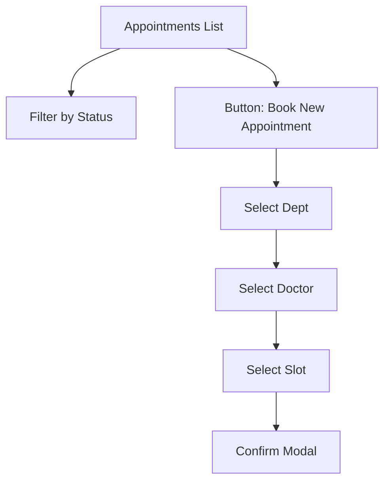
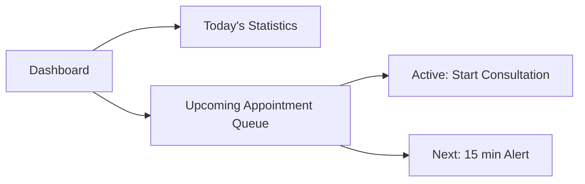
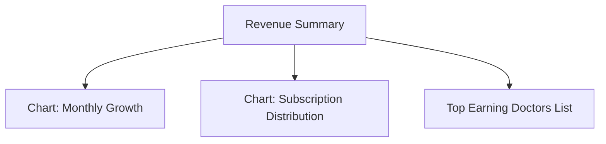

# HAMS - Project Wireframes & UI Blueprints
## Structural Design for All System Pages (A-Z)

This document provides low-fidelity wireframes and structural blueprints for the HAMS platform, serving as a comprehensive roadmap for all 25 system views.

---

### 🏥 1. Patient Portal (11 Pages)

#### **1.1 Patient Dashboard**

#### **1.2 Appointments & Booking**

#### **1.3 Medical Reports & Sharing**
| List View | Detail View (Public/Private) |
| :--- | :--- |
| **All Reports** | **Report: [ID]** |
| - Lab Result (PDF) | - Doctor Info |
| - Radiology (Image) | - Diagnosis Summary |
| - Summary (Text) | - Findings & Comments |
| [Action: Share] | [Action: Download PDF] |

#### **1.4 AI Assistant & Voice (Detailed)**
- **UI Elements**: Sidebar with Pulsating Waveform, Chat History Window, Manual Input Box.
- **Transcribe Logic**: [Speak Button] -> [Listening Indicator] -> [Transcribed Text] -> [AI Response].

#### **1.5 Billing & Subscription**
- **Billing**: Table of Recent Transactions [Date, Service, Amount, Status].
- **Subscription**: Card View showing [Basic vs Premium] options and [Khalti Upgrade] button.

#### **1.6 Chat, Profile & Settings**
- **Chat**: 2-Column layout [Doctor List] | [Message Window].
- **Profile**: Multi-section form [Personal, Medical History, Contacts].
- **Settings**: [Notification Toggles], [Reset Password], [Account Deletion].

---

### 👨‍⚕️ 2. Doctor Workspace (7 Pages)

#### **2.1 Doctor Dashboard & Queue**

#### **2.2 Schedule Configuration**
- **Calendar Grid**: Draggable blocks for availability.
- **Controls**: [Global Work Hours], [Recurring Off-Days], [Emergency Block].

#### **2.3 Patient Profiles & Chat**
- **Profile Search**: Filter by Name/ID.
- **Consultation View**: Left [Patient History] | Right [Chat Box].

#### **2.4 Reports & Sharing**
- **Generator**: Form with fields for [Clinical Findings, Internal Notes, Recommendations].
- **Sharing**: [Generate Secure Link] -> [Copy/Send via Email].

---

### 📊 3. Admin Command Center (7 Pages)

#### **3.1 Global Revenue Dashboard**

#### **3.2 User & Role Management**
| User Table | Edit/Add Modal |
| :--- | :--- |
| **User List** | **User Info** |
| [ID] [Name] [Role] [Status] | [Role Selection Dropdown] |
| [Action: Edit] | [Credential Reset Button] |
| [Action: Suspend] | [Save Changes] |

#### **3.3 Billing Oversights**
- **Admin View**: Global transaction log with [Success/Failed] filtering and [Refund Trigger] capability.

---
*Created by Antigravity AI - HAMS UI/UX Blueprint Phase*
