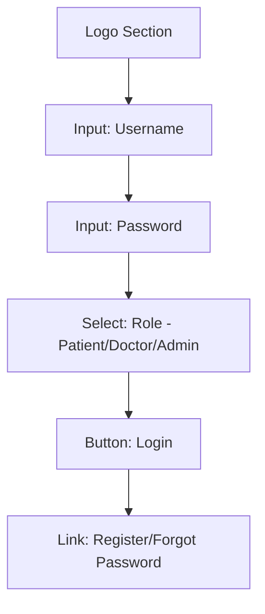
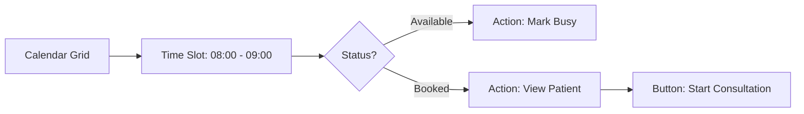

# HAMS - Project Wireframes & UI Blueprints
## Structural Design for All System Pages

This document provides low-fidelity wireframes and structural blueprints for the HAMS platform, serving as a roadmap for the front-end implementation.

---

### 🔐 1. Authentication & Onboarding
**Pages**: Login, Registration, Forgot Password.

#### **Layout Structure**

---

### 🏥 2. Patient Portal
**Pages**: Dashboard, Appointments, AI Assistant, Reports.

#### **Blueprint: Patient Dashboard**

#### **Layout: Appointment Booking**
| Header | Sidebar | Main Content |
| :--- | :--- | :--- |
| **HAMS Patient** | Dashboard | **Book Appointment** |
| Profile | Appointments | [Select Department V] |
| Logout | Reports | [Select Doctor V] |
| | AI Assistant | [Calendar View] -> [Available Slots] |
| | | [Button: Confirm Booking] |

---

### 👨‍⚕️ 3. Doctor Workspace
**Pages**: Dashboard, Schedule Management, Patient Consultation.

#### **Blueprint: Schedule Configuration**

---

### 📊 4. Admin Command Center
**Pages**: Dashboard, User Management, Billing.

#### **Layout: Revenue & Billing Dashboard**
| Metric Card | Metric Card | Metric Card |
| :--- | :--- | :--- |
| **Total Revenue** | **Active Users** | **Pending Bills** |
| $12,450.00 | 1,240 | 15 |

**Data Table: Recent Transactions**
- [ID] | [Patient Name] | [Amount] | [Status]
- #101 | John Doe | $150.00 | Paid (Khalti)
- #102 | Jane Smith | $200.00 | Pending

---

### 🤖 5. AI Voice Assistant (Modal)
**Structural Layout**
- **Header**: [AI Icon] "Health Assistant" [Close X]
- **Body**: [Waveform Visualization] (Pulsating Orb)
- **Transcription**: "Listening... Speak your health query."
- **Actions**: [Mic Mute] [Manual Input] [Clear Transcript]

---
*Created by Antigravity AI - HAMS UI/UX Blueprint Phase*
