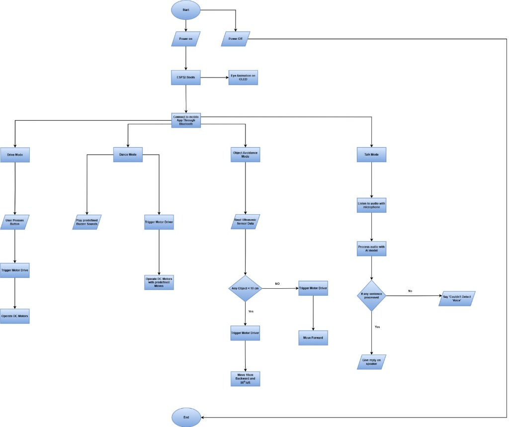

# HAMS - Hospital Advanced Management System
## Professional Project Documentation & Artifact Repository

Welcome to the official documentation for the HAMS platform. This repository contains the architectural overview, feature breakdown, and technical evidence of the HAMS production deployment.

### 📂 Directory Structure
- [Architecture & Flows](./Architecture_Flow.md): Detailed system maps and feature logic.
- [Deployment & Links](./Deployment.md): Production URLs and verification status.
- [**Artifacts Hub**](./Artifacts/): Evidence of progress organized by sprint.

---

### 🚀 Project Overview
HAMS is a state-of-the-art Hospital Management System designed for seamless Patient-Doctor interaction, secure health data management, and automated financial reporting.

#### **Key Pillars**
1.  **Security First**: Role-Based Access Control (RBAC) and encrypted data flows.
2.  **AI Enhanced**: Health assistants and voice interaction powered by Gemini.
3.  **Real-time Communication**: Seamless audio/video calling using ZegoCloud.
4.  **Financial Integrity**: Integrated billing with Khalti API and automated revenue reporting.

---

### 🎨 Visual Progress
| Feature | Evidence |
| :--- | :--- |
| **System Dashboard** |  |
| **Architectural Layout** |  |

---
*Created by Antigravity AI - HAMS Production Deployment Phase*
